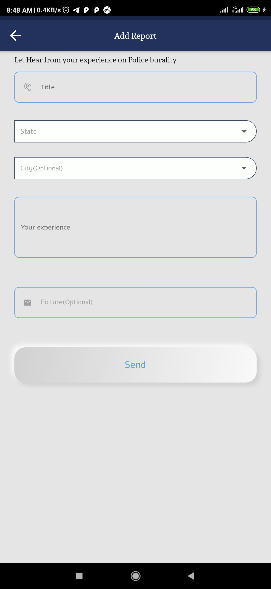
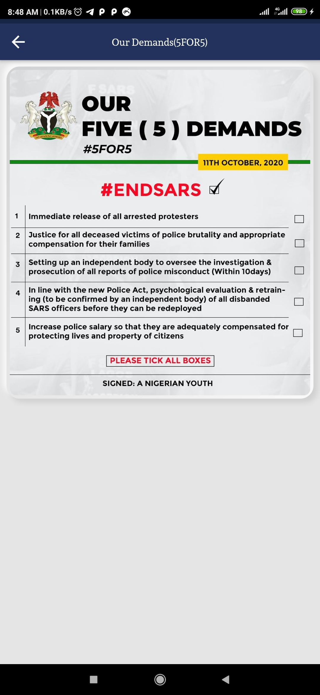

# 🔥🔥 Endsars SOROSOKE   

## ✨ Requirements
* Any Operating System (ie. MacOS X, Linux, Windows)
* Any IDE with Flutter SDK installed (ie. IntelliJ, Android Studio, VSCode etc)
* Simple knowledge of Dart and Flutter

## 📸 ScreenShots

 |  |  
 |  | 

<!-- ABOUT THE PROJECT -->
## About The Project
End SARS is a decentralised social movement, and series of mass protests against police brutality in Nigeria. 
The slogan calls for the disbanding of the Special Anti-Robbery Squad (SARS), a notorious unit of the Nigerian 
Police with a long record of abuses.[2] The protest takes its name from the slogan started in 2017 as a Twitter campaign 
using the hashtag #EndSARS to demand the disbanding of the unit by the Nigerian government.
- [Read More](https://en.wikipedia.org/wiki/End_SARS)

## SAD News!😭😭😭
On the night of 20 October 2020, at about 6:50 p.m., members of the Nigerian Army opened fire on unarmed End SARS protesters at the Lekki toll gate in Lagos State, Nigeria. Amnesty International stated that at least 12 protesters were killed during the shooting.[3] A day after the incident, on 21 October, the governor of Lagos State, Babajide Sanwo-olu, initially denied reports of any loss of lives, but
 later admitted in an interview with a CNN journalist that "only two persons were killed".
 - [Read More](https://en.wikipedia.org/wiki/2020_Lekki_shooting)

## 🤓 Author(s)
**Olajire Abdullah (SilenceCodder)** 

<!-- LICENSE -->
## License
Distributed under the MIT License. See `LICENSE.txt` for more information.

(<a href="#top">back to top</a>)

